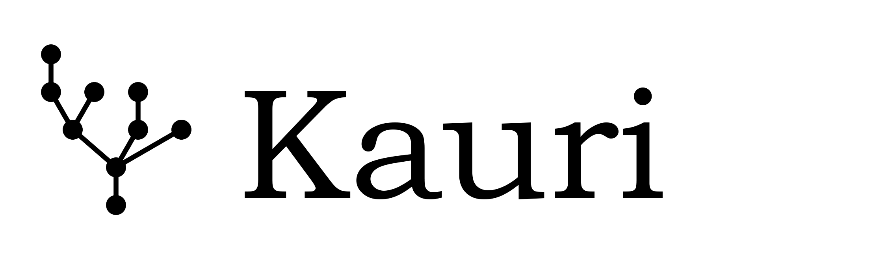

Kauri Documentation
====================

Kauri is a Python package for symbolic manipulation of rooted trees,
B-series, and Runge--Kutta methods. Install it with
``pip install kauri``.

- **Getting started:** :doc:`/pages/getting_started` -- create trees, compute coproducts, check RK order conditions
- **Core types:** :doc:`/pages/fundamentals` -- Tree, Forest, ForestSum, Maps, Display
- **Hopf algebras:** :doc:`/pages/hopf_algebras` -- BCK, CEM, Grossman--Larson (non-planar & planar)
- **Analysis:** :doc:`/pages/analysis` -- B-series, Runge--Kutta schemes, commutator-free methods
- **Non-planar trees:** :doc:`/pages/non_planar` | **Planar trees:** :doc:`/pages/planar`

.. toctree::
   :hidden:
   :maxdepth: 2

   /pages/getting_started
   /pages/fundamentals
   /pages/hopf_algebras
   /pages/analysis
   /pages/non_planar
   /pages/planar

